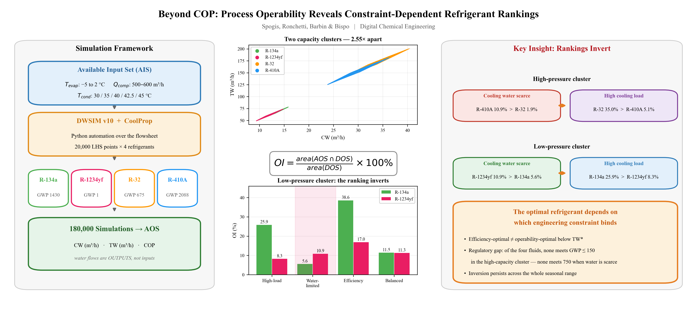

# Multi-Refrigerant Operability Analysis

**Beyond COP: process operability analysis reveals constraint-dependent refrigerant rankings in vapor compression chillers**

Nicolas Spogis ᵃ˒ᵇ, Bernardo Ronchetti ᶜ˒ᵈ, Douglas F. Barbin ᵉ, Heleno Bispo ᶠ

ᵃ AI4Tech, Campinas, SP, Brazil  
ᵇ School of Chemical Engineering, University of Campinas (UNICAMP), Campinas, SP, Brazil  
ᶜ Termoprol Zanotti, Porto Alegre, RS, Brazil  
ᵈ Department of Mechanical Engineering, Federal University of Rio Grande do Sul (UFRGS), Porto Alegre, RS, Brazil  
ᵉ School of Food Engineering, University of Campinas (UNICAMP), Campinas, SP, Brazil  
ᶠ Chemical Engineering Department, Federal University of Campina Grande (UFCG), Campina Grande, PB, Brazil

[](https://www.sciencedirect.com/journal/digital-chemical-engineering)
[](LICENSE.txt)
[](https://dwsim.org)

---

## Overview

<p align="center">
  
</p>

This repository contains the datasets, DWSIM simulation files and analysis scripts for a study
applying **process operability analysis (POA)** — a framework never previously applied to
refrigeration systems — to refrigerant selection in vapor compression chillers. Four
refrigerants (R-134a, R-1234yf, R-32 and R-410A) are compared across **180,000 steady-state
simulations** using the Operability Index (OI) of Vinson and Georgakis (2000).

Everything reported in the paper is reproducible from this repository: `apps/data_analysis.py`
reads the published datasets and regenerates every figure and every number, including the ten
figures of the manuscript.

### Key findings

- Refrigerants separate into **two non-overlapping capacity clusters** set by their operating
  pressure level, for a common compressor displacement window:
  - **Low-pressure cluster** (R-134a, R-1234yf): 9.4–15.9 m³/h of chilled water
  - **High-pressure cluster** (R-32, R-410A): 23.8–40.5 m³/h — a cluster-mean separation of **2.55×**
- COP ranges **overlap** across all four fluids (3.3–4.4), so efficiency cannot rank them.
  Capacity, not efficiency, is the primary differentiator.
- **Operability rankings invert with the binding constraint.** Under condenser cooling-water
  scarcity, R-1234yf (GWP 1) beats R-134a (GWP 1430) and R-410A (GWP 2088) beats R-32 (GWP 675);
  under a high cooling load the ranking reverts to R-134a and R-32.
- The mechanism is the **absolute position of each fluid's operating envelope**, set by its
  volumetric refrigerating effect — not any difference in heat rejected per unit of cooling.
- Treating selection as **multi-objective** (operability, efficiency, GWP) shows the
  efficiency-optimal and operability-optimal fluids genuinely diverge once water is scarce, and
  exposes a **regulatory gap**: among the four fluids studied, no high-capacity option satisfies
  a GWP cap of 150, and none satisfies even 750 under cooling-water scarcity.
- A **condensing-temperature sweep** (30–45 °C) confirms the water-scarce inversion persists
  across the whole seasonal range.

---

## Repository structure

```
multi-refrigerant-operability/
│
├── apps/
│   ├── data_analysis.py                ← analysis script: OI, optimization, all figures
│   └── analysis_outputs/
│       ├── manuscript/                    the ten figures of the paper (fig1…fig10)
│       ├── comparative/                   cross-refrigerant figures and CSV summaries
│       └── r_134a/ r_1234yf/ r_32/ r_410a/   per-refrigerant results
│
├── dataset/                            ← published DOE datasets (CSV)
│   ├── DOE_Dataset_<refrigerant>.csv      20,000 LHS points at T_cond = 40 °C
│   └── DOE_Seasonal_<refrigerant>.csv     5,000 points at each of 5 condensing temperatures
│
├── DWSIM/                              ← process simulation files (CoolProp property package)
│   └── R-134a_CoolProp.dwxmz  R-1234yf_CoolProp.dwxmz  R-32_CoolProp.dwxmz  R-410a_CoolProp.dwxmz
│
├── environment.yml                     ← conda environment
├── graphical_abstract.png
├── LICENSE.txt
└── README.md
```

---

## Getting started

### Prerequisites

- **DWSIM v10+** — [download](https://dwsim.org) (open-source process simulator), to open or
  re-run the flowsheets.
- **Python 3.11** with `numpy`, `pandas`, `scipy`, `matplotlib`. The exact environment is
  versioned:

```bash
conda env create -f environment.yml
```

### Reproducing the analysis

```bash
cd apps
python data_analysis.py
```

This reads the datasets from `dataset/`, computes the Operability Index and the multi-objective
selection, and writes every figure and CSV to `analysis_outputs/`. To regenerate only the ten
manuscript figures:

```bash
python data_analysis.py manuscript
```

---

## The chiller model

A single-stage vapor compression cycle — compressor → condenser → expansion valve → evaporator —
modelled in DWSIM with the **CoolProp** property package (Helmholtz-explicit multiparameter
equations of state). Two secondary water circuits close the model: chilled water on the
evaporator and cooling-tower water on the condenser. Because the water outlet temperatures are
fixed by specification, the two water **flow rates** are outputs of the model rather than inputs —
controller blocks adjust them until the specified temperatures are met.

| Parameter | Value |
|---|---|
| Cycle | Single-stage vapor compression |
| Property package | CoolProp |
| Compressor | Adiabatic, isentropic efficiency 75% |
| Subcooling / superheat | None |
| T_evap range (input) | −5 to 2 °C |
| Q_comp range (input) | 500 to 600 m³/h |
| T_cond | 40 °C base; swept 30 / 35 / 40 / 42.5 / 45 °C |
| Chilled water | 25 → 5 °C (ΔT = 20 K) |
| Cooling-tower water | 30 → 35 °C (ΔT = 5 K) |
| LHS points per refrigerant | 20,000 base + 5,000 × 5 seasonal levels |
| **Total simulations** | **180,000** |

### Refrigerants studied

Properties at the nominal point (T_evap = 1 °C, T_cond = 40 °C):

| Refrigerant | Type | GWP (100-yr) | Safety (ANSI/ASHRAE 34) | P_evap (bar) | P_cond (bar) | Pressure ratio | ΔT_comp (°C) |
|---|---|:---:|:---:|:---:|:---:|:---:|:---:|
| R-134a | HFC | 1430 | A1 | 3.04 | 10.17 | 3.35 | 51.0 |
| R-1234yf | HFO | 1 | A2L | 3.27 | 10.18 | 3.12 | 42.2 |
| R-32 | HFC | 675 | A2L | 8.39 | 24.78 | 2.95 | 79.8 |
| R-410A | HFC blend | 2088 | A1 | 8.24 | 24.19 | 2.94 | 63.2 |

---

## How the Operability Index is computed

The index is the Lebesgue (area) ratio of Vinson and Georgakis (2000),

```
OI = area(AOS ∩ DOS) / area(DOS) × 100%
```

evaluated in the two-dimensional output plane of **capacity** (chilled-water flow) and
**efficiency** (COP). The reduction to that plane is deliberate: the two water flows are nearly
collinear (Pearson and Spearman coefficients both above 0.99), so the three-dimensional output
set is a thin sheet and a volumetric measure would be degenerate. The cooling-water limit
therefore enters point-wise, as the admissibility condition `TW ≤ TW_max`.

The algorithm, implemented in `calc_oi`:

1. take the Achievable Output Set as the simulated operating points;
2. keep those satisfying every DOS constraint, including the cooling-water ceiling;
3. delimit that cloud by its convex hull in the (CW, COP) plane, with membership decided by a
   Delaunay triangulation so boundary points count as attainable;
4. integrate the covered fraction of the desired rectangle by Monte Carlo (200,000 samples).

The estimator converges in the number of Monte Carlo samples and is insensitive to the density of
the simulated sample — halving 20,000 points to 10,000 moves the index by less than 0.1
percentage points, and the ranking between competing refrigerants is already correct at a few
hundred points (Fig. 1 of the paper).

---

## Operability results

### DOS scenarios

Each scenario tightens one engineering constraint and relaxes the others to the cluster's
physical extreme. Capacity maps to tonnage through RT ≈ CW × 6.6.

| Scenario | Constraint stressed | Low cluster (CW_min / TW_max / COP_min) | High cluster |
|---|---|:---:|:---:|
| High-load | Chilled-water capacity | 13.5 / 78.0 / 3.30 | 34.0 / 201.0 / 3.30 |
| Water-limited | Cooling-water availability | 9.40 / 60.0 / 3.30 | 23.8 / 150.0 / 3.30 |
| Efficiency | Thermodynamic efficiency | 9.40 / 78.0 / 4.00 | 23.8 / 201.0 / 3.95 |
| Balanced | All three, moderately | 12.0 / 64.0 / 3.70 | 30.0 / 162.0 / 3.70 |

### Operability Index

**Low-pressure cluster (R-134a vs R-1234yf):**

| Scenario | R-134a | R-1234yf | Winner |
|---|:---:|:---:|:---:|
| High-load | **25.9%** | 8.3% | R-134a |
| Water-limited | 5.6% | **10.9%** | **R-1234yf** ← inversion |
| Efficiency | **38.6%** | 17.0% | R-134a |
| Balanced | **11.5%** | 11.3% | R-134a (tie) |

**High-pressure cluster (R-32 vs R-410A):**

| Scenario | R-32 | R-410A | Winner |
|---|:---:|:---:|:---:|
| High-load | **35.0%** | 5.1% | R-32 |
| Water-limited | 1.9% | **10.9%** | **R-410A** ← inversion |
| Efficiency | **38.8%** | 18.8% | R-32 |
| Balanced | 7.5% | **14.0%** | **R-410A** |

### Multi-objective selection

Objectives: operability (maximise), mean COP over the input space (maximise), GWP (minimise).
The ε-constraint rule maximises efficiency subject to OI ≥ 3% and a GWP ceiling. The operability
floor is applied *before* efficiency is compared, so a fluid below it is eliminated rather than
ranked second — which is why the efficiency-optimal entry for the water-limited high-pressure
context is R-410A even though R-32 has the higher mean COP (3.825 against 3.681).

| Cluster | Scenario | Efficiency-optimal (OI-feasible) | Operability-optimal | GWP ≤ 150 | GWP ≤ 750 | GWP ≤ 2500 |
|---|---|:---:|:---:|:---:|:---:|:---:|
| Low | High-load | R-134a | R-134a | R-1234yf | R-1234yf | R-134a |
| Low | Water-limited | R-134a | **R-1234yf** | R-1234yf | R-1234yf | R-134a |
| Low | Efficiency | R-134a | R-134a | R-1234yf | R-1234yf | R-134a |
| Low | Balanced | R-134a | R-134a | R-1234yf | R-1234yf | R-134a |
| High | High-load | R-32 | R-32 | none | R-32 | R-32 |
| High | Water-limited | R-410A | R-410A | none | **none** | R-410A |
| High | Efficiency | R-32 | R-32 | none | R-32 | R-32 |
| High | Balanced | R-32 | **R-410A** | none | R-32 | R-32 |

The two criteria diverge in the two rows marked in bold. The operability winner switches
continuously at a cooling-water threshold of about **67 m³/h** in the low-pressure cluster and
**176 m³/h** in the high-pressure cluster.

---

## Citation

```bibtex
@article{Spogis2026operability,
  title   = {Beyond {COP}: process operability analysis reveals
             constraint-dependent refrigerant rankings in vapor
             compression chillers},
  author  = {Spogis, Nicolas and Ronchetti, Bernardo and
             Barbin, Douglas F. and Bispo, Heleno},
  journal = {Digital Chemical Engineering},
  year    = {2026},
  note    = {Under review}
}
```

## License

MIT — see [LICENSE.txt](LICENSE.txt).

## Acknowledgments

- **[FEQ/UNICAMP](https://www.feq.unicamp.br)** — School of Chemical Engineering, University of Campinas
- **[FEA/UNICAMP](https://www.fea.unicamp.br)** — School of Food Engineering, University of Campinas
- **[UFCG](https://www.ufcg.edu.br)** — Federal University of Campina Grande
- **[UFRGS](https://www.ufrgs.br)** — Federal University of Rio Grande do Sul
- **[Termoprol Zanotti](https://termoprol.com.br)** — Porto Alegre, RS
- **[DWSIM](https://dwsim.org)** — open-source process simulator developed by Daniel Wagner Oliveira de Medeiros

## Key references

- Vinson, D.R., Georgakis, C. (2000). A new measure of process output controllability. *Journal of Process Control* 10(2–3), 185–194.
- Georgakis, C. et al. (2003). On the operability of continuous processes. *Control Engineering Practice* 11(8), 859–869.
- Lima, F.V., Georgakis, C. (2010). Input–output operability of control systems: the steady-state case. *Journal of Process Control* 20(6), 769–776.
- Gazzaneo, V. et al. (2020). Process operability algorithms: past, present, and future developments. *Ind. Eng. Chem. Res.* 59(6), 2457–2470.
- Alves, V. et al. (2024). Opyrability: a Python package for process operability analysis. *JOSS* 9(94), 5966.
- Bell, I.H. et al. (2014). Pure and pseudo-pure fluid thermophysical property evaluation and the open-source thermophysical property library CoolProp. *Ind. Eng. Chem. Res.* 53(6), 2498–2508.
- Mota-Babiloni, A. et al. (2017). Recent investigations in HFCs substitution with lower GWP synthetic alternatives. *Int. J. Refrigeration* 82, 288–301.
- Garcia Pabon, J.J. et al. (2020). Applications of refrigerant R1234yf in heating, air conditioning and refrigeration systems: a decade of researches. *Int. J. Refrigeration* 118, 104–113.
